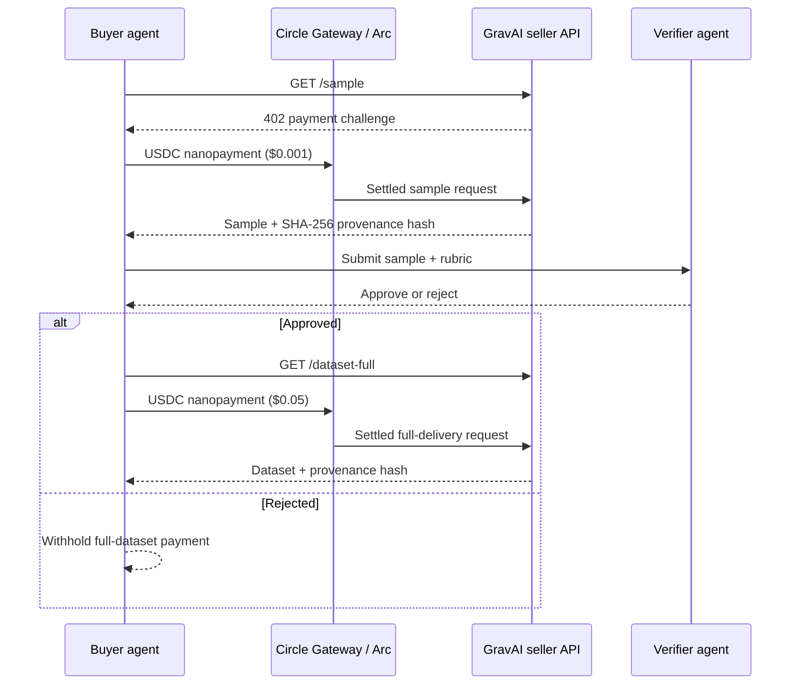

# GravAI

**Verified human demonstration data, purchased autonomously by AI agents.**

GravAI is an agentic data marketplace on Arc testnet. A buyer agent pays a
sub-cent USDC nanopayment for a human-work sample; a verifier evaluates the
sample against a task rubric; only an approved delivery unlocks a second,
larger USDC purchase for the full dataset.

Circle Gateway batches signed off-chain USDC authorizations, making the
sample-first procurement loop economically viable at nanopayment scale.

> **Testnet prototype only.** Fixtures demonstrate computer-use payloads; real
> USDC nanopayments settle on Arc testnet. Do not send production funds.

## Live demo

| Link | URL |
| --- | --- |
| App | See [Live URL](#live-url) below after deploy |
| Repo | https://github.com/tetheusz/gravai |
| Deck | `gravai-deck.pptx` (upload to Google Slides for sharing) |

### Live URL

After Vercel deploy, set the public URL here (and in the Encode CP3 form):

```
https://YOUR-PROJECT.vercel.app
```

## The autonomous loop



## Table of Contents

- [Prerequisites](#prerequisites)
- [Getting Started](#getting-started)
- [How It Works](#how-it-works)
- [Paywalled Endpoints](#paywalled-endpoints)
- [Seller Dashboard](#seller-dashboard)
- [Environment Variables](#environment-variables)
- [Demo Credentials](#demo-credentials)
- [Scripts](#scripts)

## Prerequisites

- **Node.js v22+** — Install via [nvm](https://github.com/nvm-sh/nvm)
- **Supabase** — remote project or local CLI + Docker
- **Gemini API key** (preferred) or OpenAI — verifier LLM; heuristic fallback always works
- Funded Arc testnet buyer wallet (USDC + gas) via [Circle faucet](https://faucet.circle.com/)

## Getting Started

1. Clone the repository and install dependencies:

   ```bash
   git clone https://github.com/tetheusz/gravai.git
   cd gravai
   npm install
   ```

2. Set up environment variables:

   ```bash
   cp .env.example .env.local
   ```

   Then edit `.env.local` and fill in all required values (see [Environment Variables](#environment-variables)).

3. Generate seller and buyer wallets (if you do not already have them):

   ```bash
   npm run generate-wallets
   ```

   Fund the buyer wallet with testnet USDC via the [Circle faucet](https://faucet.circle.com/) (`ARC-TESTNET`).

4. Set up the database — remote Supabase recommended for demos:

   ```bash
   npx supabase link --project-ref <your-project-ref>
   npx supabase db push
   ```

5. Start the development server:

   ```bash
   npm run dev
   ```

   App: `http://localhost:3000`

6. Optional CLI loop:

   ```bash
   npm run gravai
   ```

## How It Works

- [Next.js](https://nextjs.org/) App Router seller API and marketplace dashboard
- [x402](https://www.x402.org/) + [Circle Gateway](https://developers.circle.com/gateway/nanopayments) for gasless USDC nanopayments on [Arc](https://arc.network/)
- `@circle-fin/x402-batching`: `GatewayClient` (buyer) and `BatchFacilitatorClient` (seller)
- Verifier: Gemini → OpenAI → deterministic rubric fallback
- SHA-256 provenance manifests on preview and full delivery
- Supabase realtime settlement ledger and seller Gateway withdrawals
- Dashboard **Run buyer agent** streams the full gated loop over SSE

## Paywalled Endpoints

| Endpoint | Method | Price (USDC) | Description |
| --- | --- | --- | --- |
| `/api/premium/sample` | GET | $0.001 | Excel/FP&A pt-BR computer-use preview + provenance hash |
| `/api/premium/dataset-full` | GET | $0.05 | Full delivery after verifier approval |
| `/api/premium/dataset` | GET | $0.01 | Legacy preview endpoint (compat) |

## Seller Dashboard

`/dashboard` provides:

- Live **Run buyer agent** panel (Standard gate vs Strict withhold)
- Marketplace stats and approval-based reputation v1
- Real-time settlement ledger linked to [Arcscan](https://testnet.arcscan.app)
- Gateway balance + withdraw controls

Protected operator routes require the demo session cookie. Agent runs are
rate-limited to protect the funded buyer wallet during judging.

## Environment Variables

| Variable | Scope | Purpose |
| --- | --- | --- |
| `NEXT_PUBLIC_SUPABASE_URL` | Public | Supabase project URL |
| `NEXT_PUBLIC_SUPABASE_PUBLISHABLE_KEY` | Public | Supabase anon / publishable key |
| `SUPABASE_SERVICE_ROLE_KEY` | Server | Record payment events and withdrawals |
| `SELLER_ADDRESS` / `SELLER_PRIVATE_KEY` | Server | Seller wallet + Gateway withdraw |
| `BUYER_ADDRESS` / `BUYER_PRIVATE_KEY` | Server | Buyer agent payments from the dashboard |
| `GEMINI_API_KEY` / `GEMINI_MODEL` | Server | Preferred verifier LLM |
| `OPENAI_API_KEY` | Server | Optional verifier / LangChain fallback |

## Demo Credentials

| Email | Password |
| --- | --- |
| `demo@gravai.app` | `demo` |

One-click **Enter as demo** is available on the landing page.

### Quick judge path

1. Open the live URL (or `http://localhost:3000`) → **Operator** → **Enter as demo**
2. **Run buyer agent** (Standard gate) — sample unlocks, LLM verifies, full dataset settles
3. Switch to **Strict gate** and run again — full payment withheld
4. Watch settlements appear live in the ledger; optionally withdraw seller earnings

## Scripts

| Script | Purpose |
| --- | --- |
| `npm run dev` | Local Next.js server |
| `npm run build` | Production build |
| `npm run lint` | ESLint |
| `npm run test:verifier` | Heuristic gate smoke test (approve vs strict) |
| `npm run gravai` | CLI autonomous purchase loop |
| `npm run deck` | Regenerate `gravai-deck.pptx` |
| `npm run generate-wallets` | Create seller/buyer keys into `.env.local` |

## Security & Usage Model

- Arc **testnet** only
- Secrets via environment variables (never commit `.env.local`)
- Demo auth is intentionally public for hackathon judges — not production-ready
