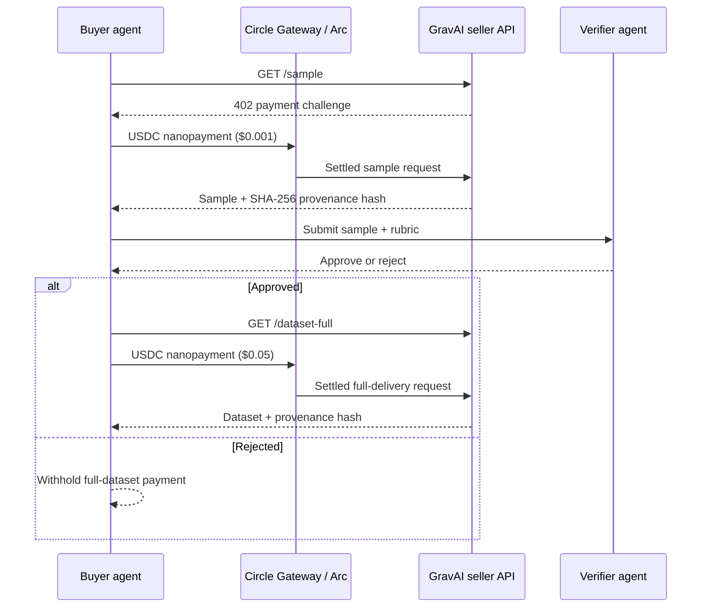

# GravAI

**Verified human demonstration data, purchased autonomously by AI agents.**

GravAI is an agentic data marketplace on Arc testnet. A buyer agent pays a
sub-cent USDC nanopayment for a human-work sample; a verifier evaluates the
sample against a task rubric; only an approved delivery unlocks a second,
larger USDC purchase for the full dataset.

Circle Gateway batches signed off-chain USDC authorizations, making the
sample-first procurement loop economically viable at nanopayment scale.

> **Testnet prototype only.** No real human data or production funds should be
> sent to this repository.

## The autonomous loop



## Table of Contents

- [Prerequisites](#prerequisites)
- [Getting Started](#getting-started)
- [How It Works](#how-it-works)
- [Paywalled Endpoints](#paywalled-endpoints)
- [Seller Dashboard](#seller-dashboard)
- [Environment Variables](#environment-variables)
- [Demo Credentials](#demo-credentials)

## Prerequisites

- **Node.js v22+** — Install via [nvm](https://github.com/nvm-sh/nvm)
- **Supabase CLI** — Install via `npm install -g supabase` or see [Supabase CLI docs](https://supabase.com/docs/guides/cli/getting-started)
- **Docker Desktop** (only if using the local Supabase path) — [Install Docker Desktop](https://www.docker.com/products/docker-desktop/)
- *(Optional)* An **[OpenAI API key](https://platform.openai.com/api-keys)** — enables the LLM-driven payment agent. Without it, the agent runs in mock mode with scripted tool calls.

## Getting Started

1. Clone the repository and install dependencies:

   ```bash
   git clone https://github.com/akelani-circle/arc-nanopayments-demo.git
   cd arc-nanopayments-demo
   npm install
   ```

2. Set up environment variables:

   ```bash
   cp .env.example .env.local
   ```

   Then edit `.env.local` and fill in all required values (see [Environment Variables](#environment-variables) section below).

3. Generate seller and buyer wallets:

   ```bash
   npm run generate-wallets
   ```

   This creates two EVM wallets (seller and buyer) and writes the addresses and private keys to `.env.local`. Follow the on-screen instructions to fund the buyer wallet with testnet USDC via the [Circle faucet](https://faucet.circle.com/).

4. Set up the database — Choose one of the two paths below:

   <details>
   <summary><strong>Path 1: Local Supabase (Docker)</strong></summary>

   Requires Docker Desktop installed and running.

   ```bash
   npx supabase start
   npx supabase migration up
   ```

   The output of `npx supabase start` will display the Supabase URL and API keys needed for your `.env.local`.

   </details>

   <details>
   <summary><strong>Path 2: Remote Supabase (Cloud)</strong></summary>

   Requires a [Supabase](https://supabase.com/) account and project.

   ```bash
   npx supabase link --project-ref <your-project-ref>
   npx supabase db push
   ```

   Retrieve your project URL and API keys from the Supabase dashboard under **Settings > API**.

   </details>

5. Start the development server:

   ```bash
   npm run dev
   ```

   The app will be available at `http://localhost:3000`.

6. Run the GravAI autonomous purchase loop:

   ```bash
   npm run gravai
   ```

   The script creates an ephemeral buyer wallet, funds it, deposits USDC into
   Circle Gateway, buys `/sample`, runs the verifier, and purchases
   `/dataset-full` only on approval. It uses `OPENAI_API_KEY` when available
   and falls back to a deterministic rubric evaluator if the provider is
   unavailable.

## How It Works

- [Next.js](https://nextjs.org/) App Router seller API and marketplace dashboard
- [x402](https://www.x402.org/) + [Circle Gateway](https://developers.circle.com/gateway/nanopayments) for gasless USDC nanopayments on [Arc](https://arc.network/)
- `@circle-fin/x402-batching`: `GatewayClient` on the buyer and
  `BatchFacilitatorClient` on the seller
- Verifier agent with an OpenAI evaluation path and a deterministic rubric
  fallback for reliable demos
- SHA-256 provenance manifests returned with the preview and full delivery
- Supabase real-time settlement ledger and seller payout controls

## Paywalled Endpoints

The seller exposes several x402-protected API routes at different price points:

| Endpoint | Method | Price (USDC) | Description |
| --- | --- | --- | --- |
| `/api/premium/sample` | GET | $0.001 | Excel/FP&A pt-BR computer-use preview + provenance hash |
| `/api/premium/dataset-full` | GET | $0.05 | Full delivery, available only after verifier approval |
| `/api/premium/dataset` | GET | $0.01 | Legacy preview endpoint kept for compatibility |

Each endpoint returns `402 Payment Required` for unpaid requests. The buyer agent automatically signs the authorization and retries with the payment signature to receive the content.

## Seller Dashboard

The dashboard at `/dashboard` provides:

- **Marketplace state** — settled USDC, verified deliveries, buyer agents, and
  approval-based seller reputation
- **Settlement ledger** — real-time paid previews and full deliveries, linked to
  [Arcscan](https://testnet.arcscan.app)
- **Gateway payout controls** — inspect Gateway balances and withdraw to a
  supported testnet address

## Environment Variables

Copy `.env.example` to `.env.local` and fill in the required values:

```bash
# Supabase
NEXT_PUBLIC_SUPABASE_URL=your-project-url
NEXT_PUBLIC_SUPABASE_PUBLISHABLE_KEY=your-publishable-or-anon-key
SUPABASE_SERVICE_ROLE_KEY=your-service-role-key

# x402 / Circle Nanopayments
SELLER_ADDRESS=0xYourWalletAddress
SELLER_PRIVATE_KEY=0xYourSellerPrivateKey

# Buyer wallet (for the payment agent)
BUYER_ADDRESS=0xYourBuyerWalletAddress
BUYER_PRIVATE_KEY=0xYourBuyerPrivateKey

# AI Payment Agent (optional — omit to run in mock mode)
# OPENAI_API_KEY=your-openai-api-key
```

| Variable | Scope | Purpose |
| --- | --- | --- |
| `NEXT_PUBLIC_SUPABASE_URL` | Public | Supabase project URL. |
| `NEXT_PUBLIC_SUPABASE_PUBLISHABLE_KEY` | Public | Supabase anonymous / publishable key. |
| `SUPABASE_SERVICE_ROLE_KEY` | Server-side | Supabase service-role key, used to record payment events and withdrawals. |
| `SELLER_ADDRESS` | Server-side | EVM wallet address for receiving USDC payments. |
| `SELLER_PRIVATE_KEY` | Server-side | Seller wallet private key, used for Gateway balance queries and withdrawals. |
| `BUYER_ADDRESS` | Agent | Buyer wallet address for making payments. |
| `BUYER_PRIVATE_KEY` | Agent | Buyer wallet private key for signing payment authorizations. |
| `OPENAI_API_KEY` | Agent | *(Optional)* OpenAI API key. If omitted, the agent runs in mock mode with scripted tool calls. |
| `GEMINI_API_KEY` | Server | *(Preferred)* Gemini API key for the verifier agent. Falls back to OpenAI, then heuristic. |
| `GEMINI_MODEL` | Server | *(Optional)* Gemini model id. Defaults to `gemini-flash-lite-latest`. |

> **Tip:** Run `npm run generate-wallets` to auto-generate the `SELLER_ADDRESS`, `SELLER_PRIVATE_KEY`, `BUYER_ADDRESS`, and `BUYER_PRIVATE_KEY` values.

## Demo Credentials

Hackathon judges can open the dashboard without guessing credentials:

| Email | Password |
| --- | --- |
| `demo@gravai.app` | `demo` |

The landing-page login modal also shows these credentials and offers a one-click **Enter as demo** button.

### Quick judge path

1. Open `/` → **Operator** → **Enter as demo**
2. On `/dashboard`, click **Run buyer agent** (Standard gate) — sample unlocks, LLM verifies, full dataset settles
3. Switch to **Strict gate** and run again — payment for the full dataset is withheld
4. Watch settlements appear live in the ledger below

## Security & Usage Model

This sample application:
- Assumes testnet usage only
- Handles secrets via environment variables
- Is not intended for production use without modification
